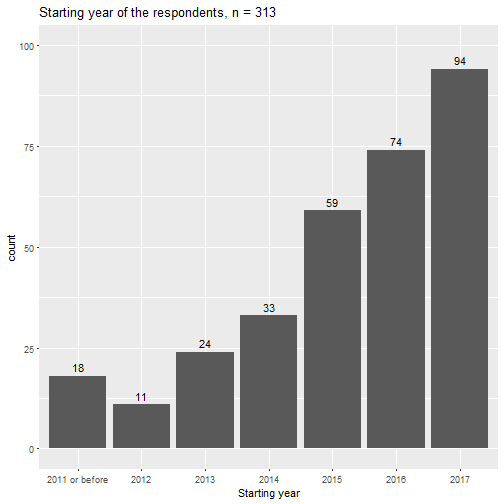
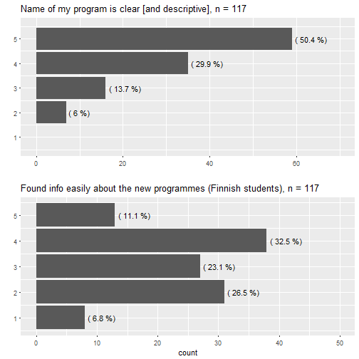
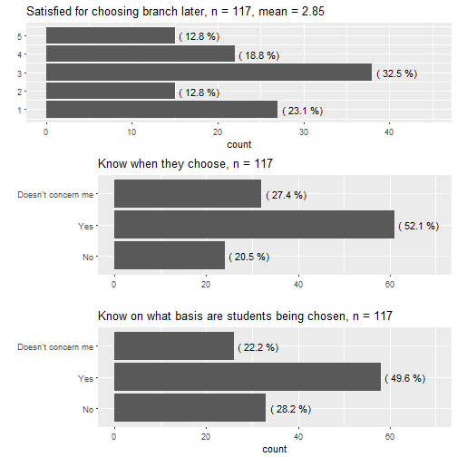
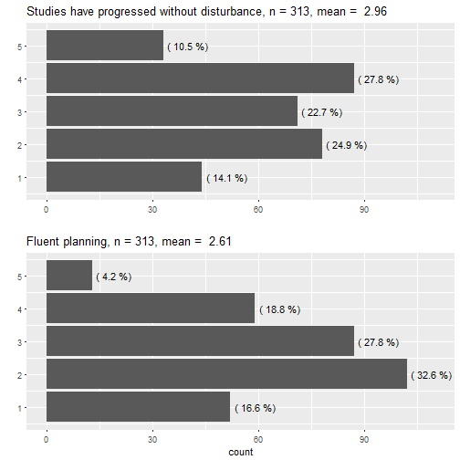
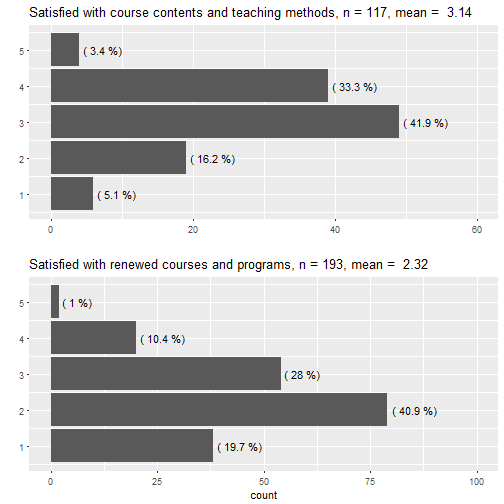
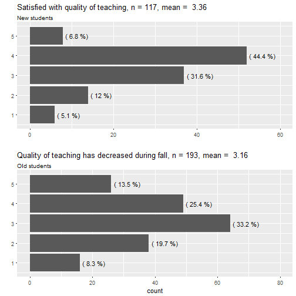

Results of Kannunvalajat study questionnaire
========================================================
author: Riku Laine
date: 18.12.2017
autosize: true

Contents
========================================================

- The data in brief
- Results by theme
- Summaries
- Discuss/recommendations

The data in brief (1/2)
========================================================

- The data is the result of student questionnaire held between XX.XX. and YY.YY. 
- A total of 313 respondents of which
  * 117 study by the current curriculum
  * 193 study by the old curriculum
- Also three students studying by the current curricula answered in English.

***

The data in brief (2/2)
========================================================
left: 45%

- The questionnaire consisted of 34 or 37 questions dependending the respondents' curricula.
- Most of the questions were answered in the 5-point [Likert scale](https://en.wikipedia.org/wiki/Likert_scale).
  * Open-ended questions were removed from the given data for privacy reasons.

  
***

|Program/Subject                    | Frequency|
|:----------------------------------|---------:|
|Sosiaalitieteiden kandiohjelma     |        41|
|Yleinen valtio-oppi                |        29|
|Polvi (kandi)                      |        28|
|Viestintä                          |        25|
|Sosiologia                         |        20|
|Poliittinen historia               |        19|
|Yhteiskuntapolitiikka              |        18|
|Sosiaalipsykologia                 |        17|
|Sosiaali- ja kulttuuriantropologia |        14|
|Sosiaalitieteiden maisteriohjelma  |        14|

Marketing
===========
left: 40%

- Clarity of name of the new programs has been quite good, mean of answers was $\approx$ 4.25.
- Communication hasn't been that succesful as one in three respondents (33.3%) claimed they couldn't find info easily.

***

Choosing the study path
=========================
left:40%

- Students are somewhat divided if they are satisfied with choosing their path later *(Mann-Whitney U; p* $\approx$ *0.15)*.
- Almost one in four (28%) who must choose a path know when to do it
- The students have also a pretty bad knowledge on what basis are they being chosen as only 36% know.

***

Planning and the proceeding of studies
===============================================

- Almost two in five (39%) disagreed or strongly disagreed to the claim their studies had proceeded fluently.
- Nearly half of the students have experienced that planning their studies has not been smooth.

***

Courses
======================================

- Almost half think the reform has affected the amount of mandatory presence and supply of alternative ways to take exams. (NB the amount of DK's)
- Students have pretty much liked methods and contents
- 60% weren't satisfied with the renewed syllabus (compared to the previous years)

***

|Answers.in.percentages |  Yes|   No|   DK|
|:----------------------|----:|----:|----:|
|Mandatory presence     | 43.5| 22.3| 34.2|
|Alternative examining  | 49.7|  7.3| 43.0|

Teaching
===================================

- New students are quite satisfied with the quality of teaching, more than half agreed or strongly agreed. 
- I wouldn't say that the students have experinced the reform too badly
  * Distribution of answers quite symmetrical
  * Relatively low number of extreme answers

***

General opinions
============================================

***

- The reform is regarded as a good thing
- Some students have thought about changing to a new program, but majority want to stick with the old
- No regret noticeable, almost no one had rather applied to a new program

Correspondence tables (CT)
===========================

- Clarity of especially minor subjects' correspondence tables should be improved.
- Students seem to have hard time finding their minors' correspondence tables.

***

|                           |   No|  Yes|
|:--------------------------|----:|----:|
|Major's CTs are clear      | 28.5| 71.5|
|Minor's CTs are clear      | 64.8| 35.2|
|Know where are major's CTs |  8.8| 91.2|
|Know where are minor's CTs | 52.3| 47.7|

Study counselling
====================

***

Student representatives
=============================

- Study representatives *(opintovastaavat)* are known by every three in five students.
- Students don't know the student representatives of their programs' executive groups *(johtoryhmien opiskelijaedustajat)*.

***

**Do you know the student representatives of your...?**

|                          |   No|  Yes|
|:-------------------------|----:|----:|
|Student organisation      | 38.6| 61.4|
|Program's executive group | 70.8| 29.2|

