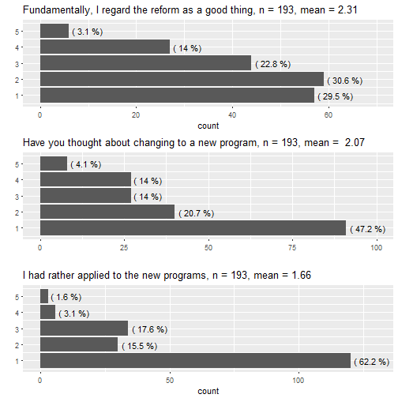
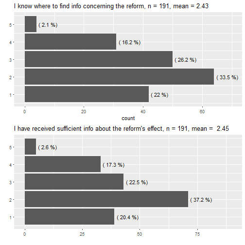
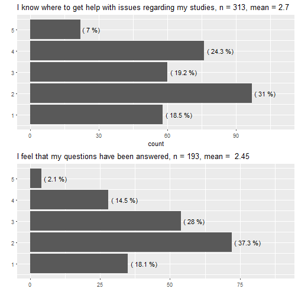

Results of Kannunvalajat study questionnaire
========================================================
author: Riku Laine
date: 10.1.2018
autosize: true

Contents
========================================================

- The data in brief

- Results by theme

- Some notes

***

**Themes:**
- *Marketing*
- *Choosing the branch of studies*
- *Planning and progression of studies*
- *Courses*
- *Teaching*
- *General opinions towards the reform*
- *Correspondence tables*
- *Communication of the reform*
- *Study counselling*
- *Student representatives*

The data in brief (1/2)
========================================================

- The data is the result of a student questionnaire held in November.
- A total of 313 respondents of which
  * 117 study by the current curriculum
  * 193 study by the old curriculum
- Also three students studying by the current curricula answered in English.

***

The data in brief (2/2)
========================================================
left: 45%

- The questionnaire consisted of 34 or 37 questions depending on the respondent's curriculum.
- Most of the questions were answered in the 5-point [Likert scale](https://en.wikipedia.org/wiki/Likert_scale).
  * Open-ended questions were removed
    + *1 = Strongly disagree*
    + *5 = Strongly agree*

  
***

|Program/Subject                    | Frequency|
|:----------------------------------|---------:|
|Sosiaalitieteiden kandiohjelma     |        41|
|Yleinen valtio-oppi                |        29|
|Politiikka ja viestintä            |        28|
|Viestintä                          |        25|
|Sosiologia                         |        20|
|Poliittinen historia               |        19|
|Yhteiskuntapolitiikka              |        18|
|Sosiaalipsykologia                 |        17|
|Sosiaali- ja kulttuuriantropologia |        14|
|Sosiaalitieteiden maisteriohjelma  |        14|

Marketing
===========
left: 40%

- Names of the new programs have been quite descriptive, mean of the answers was $\approx$ 4.25.
- Marketing hasn't been that successful as one in three respondents (33.3%) claimed they couldn't find info easily.

***

Choosing the branch of studies
=========================
left:45%

- Students are somewhat divided if they are satisfied with choosing their branch at a later stage.
- Almost one in four (28%) of those who must choose a path don't know when to do it.
- The criteria for enrollment is also quite unknown.

***

Planning and progress of studies
===============================================

- Almost two in five (39%) claimed their studies had not proceeded without disturbance.
- Nearly half of the students have experienced that planning their studies has not been smooth.

***

Courses - practices
======================================

- Almost half think the reform has affected the amount of mandatory presence and supply of alternative ways to pass courses (essays etc.). *(NB the amount of Don't knows)*
- Students have pretty much liked methods and contents.
- 60% weren't satisfied with the new courses and programs (compared to the previous years).

***

|Has.reform.affected   |  Yes|   No|   DK|
|:---------------------|----:|----:|----:|
|Mandatory presence    | 43.5| 22.3| 34.2|
|Alternative examining | 49.7|  7.3| 43.0|

Courses - attending
====================

- One in five couldn't have attended the courses of the new programs that belong to their major studies.
- Roughly twice larger a portion is not able to participate in their minor subject's courses.

****

**I am able to attend the courses that belong to my [...] studies.** (n = 193, in %)

|      |   No|  Yes|
|:-----|----:|----:|
|Major | 21.2| 78.8|
|Minor | 37.8| 62.2|

Teaching
===================================

- New students are quite satisfied with the quality of teaching, more than half agreed or strongly agreed. 
- Some of the old students feel that the quality of teaching has decreased, though the distribution of answers is quite symmetrical.

***

General opinions
============================================

***

- The Big Wheel is not well appreciated among students per se.
- Some students have thought about changing to a new program, but majority want to stick with the old
- No regret noticeable, almost no one had rather applied to a new program

Correspondence tables (CT)
===========================

- Clarity of especially minor subjects' correspondence tables should be improved.
- Students seem to have a hard time finding their minors' correspondence tables.

***

*n = 193*

|                           |   No|  Yes|
|:--------------------------|----:|----:|
|Major's CTs are clear      | 28.5| 71.5|
|Minor's CTs are clear      | 64.8| 35.2|
|Know where are major's CTs |  8.8| 91.2|
|Know where are minor's CTs | 52.3| 47.7|

Communication of the reform
====================

- Information concerning the Big Wheel has been hard to find and insufficient.
  * Over half of the respondents disagreed or strongly disagreed to both of the claims.

***

Study counselling
==================

- There is room for improvement as half of the students think their questions have been left unanswered.

**I have received help in problem situations concerning my studies.**

(n = 310)

| No|  Yes| I haven't had issues|
|--:|----:|--------------------:|
| 29| 47.7|                 23.2|

***

Student representatives
=============================

- Study representatives *(opintovastaavat)* are known by every three in five students.
- Students don't know the student representatives of their programs' executive groups *(johtoryhmien opiskelijaedustajat)*.

***

**Do you know the student representatives of your...?**

|                          |   No|  Yes|
|:-------------------------|----:|----:|
|Student organisation      | 38.6| 61.4|
|Program's executive group | 70.8| 29.2|

Some notes
===============================

- One big topic reflecting on all the answers is **the lack or unavailability of information**.
  * Marketing and informing has to be thought in a new way.
  * Good communication releases student counselling's resources when answers to "easy" questions are readily available.
- Although there has been "turbulence" in some students' studies, it isn't necessarily caused by the reform.
  * Economic issues? Mental issues? Health issues?
  
